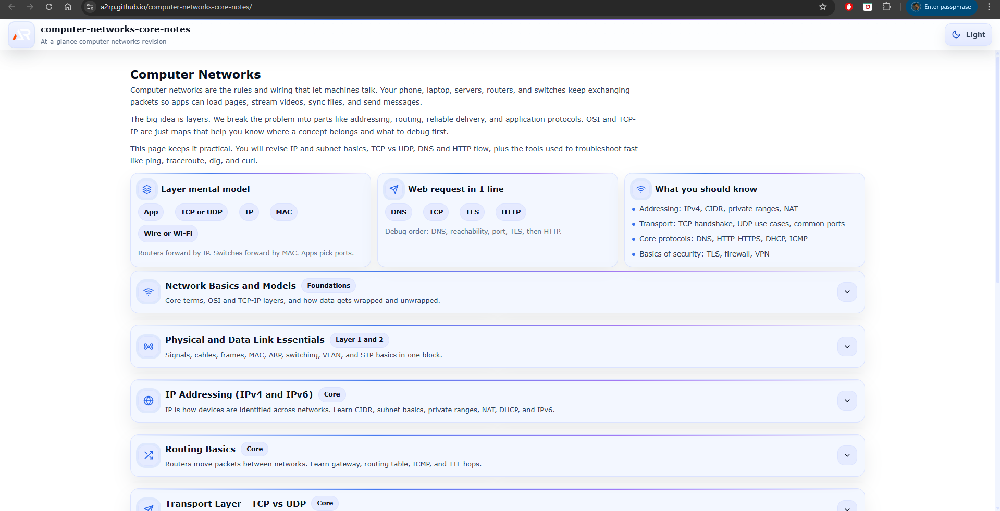

# Computer Networks Core Notes

A single-page, at-a-glance revision project for core Computer Networks concepts.

This project is designed as a fast reference and structured summary sheet covering essential networking topics without unnecessary depth.  
It focuses on clarity, protocol-level understanding, real-world packet flow, and interview-ready fundamentals.

---



---

## Purpose

- Quick revision before interviews
- Rapid recall of core networking concepts
- Clear mental model of how data moves across networks
- Practical, production-focused reminders
- Strong foundation in protocols, routing, addressing, transport, and security without overload

## Coverage

- What is a Computer Network
- Types of networks
    - LAN
    - MAN
    - WAN
    - PAN
- Network topologies
    - Star
    - Mesh
    - Bus
    - Ring

- OSI Model
    - 7 layers overview
    - Layer responsibilities
- TCP/IP Model
    - Layer mapping with OSI
    - Encapsulation concept

- Data Link Layer
    - MAC address basics
    - ARP
    - Framing concept
    - Switch basics
    - VLAN overview

- IP Addressing
    - IPv4 structure
    - CIDR notation
    - Subnetting fundamentals
    - Private IP ranges
    - NAT basics
    - DHCP overview
    - IPv6 basics

- Routing
    - Router vs Switch
    - Routing table concept
    - Default gateway
    - Static vs Dynamic routing
    - RIP, OSPF, BGP overview
    - ICMP basics

- Transport Layer
    - Port numbers
    - TCP vs UDP
    - Three-way handshake
    - Flow control
    - Congestion control overview

- Application Layer Protocols
    - HTTP vs HTTPS
    - DNS basics
    - SMTP, POP3, IMAP
    - FTP vs SFTP
    - SSH
    - WebSockets overview

- Web Networking
    - URL structure
    - What happens when you type a URL
    - Cookies and sessions overview
    - CORS basics
    - CDN concept
    - Proxy vs Reverse Proxy
    - Load balancer basics

- Network Security
    - CIA triad
    - TLS overview
    - Symmetric vs Asymmetric encryption
    - Hashing basics
    - Authentication vs Authorization
    - Firewall concept
    - VPN basics
    - Common attacks overview

- Networking Tools
    - ping
    - traceroute
    - nslookup or dig
    - ipconfig or ifconfig
    - netstat or ss
    - curl
    - Wireshark basics

- Performance and Reliability
    - Latency
    - Throughput
    - Packet loss
    - MTU concept
    - QoS overview
    - Caching basics

- Must-know interview questions and answers

## Tech Stack

- React
- Vite
- styled-components

## Project Type

Single page only  
Section-based navigation  
Searchable and expandable content  
No blog-style content, only structured notes

Each topic is modular and collapsible for fast scanning.

## Run Locally

```bash
npm install
npm run dev
```

## Goal

Complete core Computer Networks knowledge in one scrollable page.

No fluff.
No repetition.
Just protocol-level clarity.
